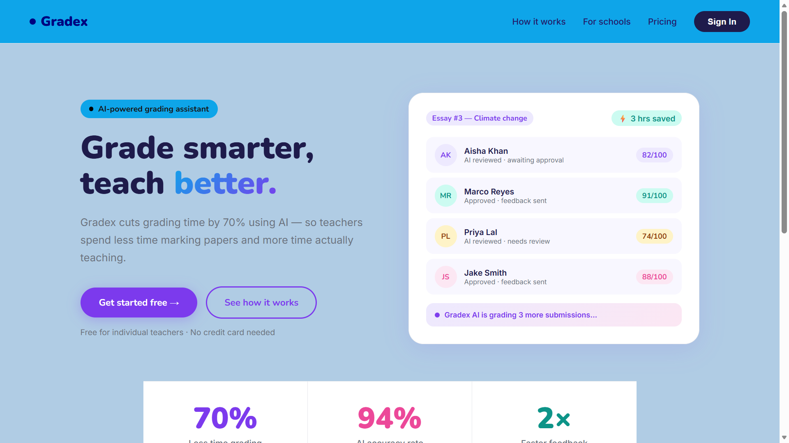
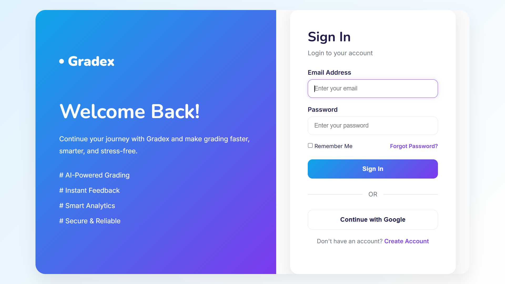
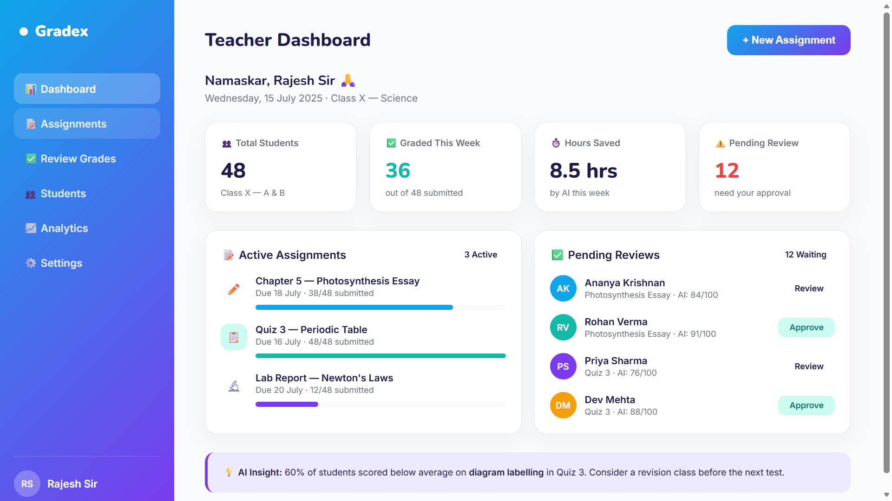
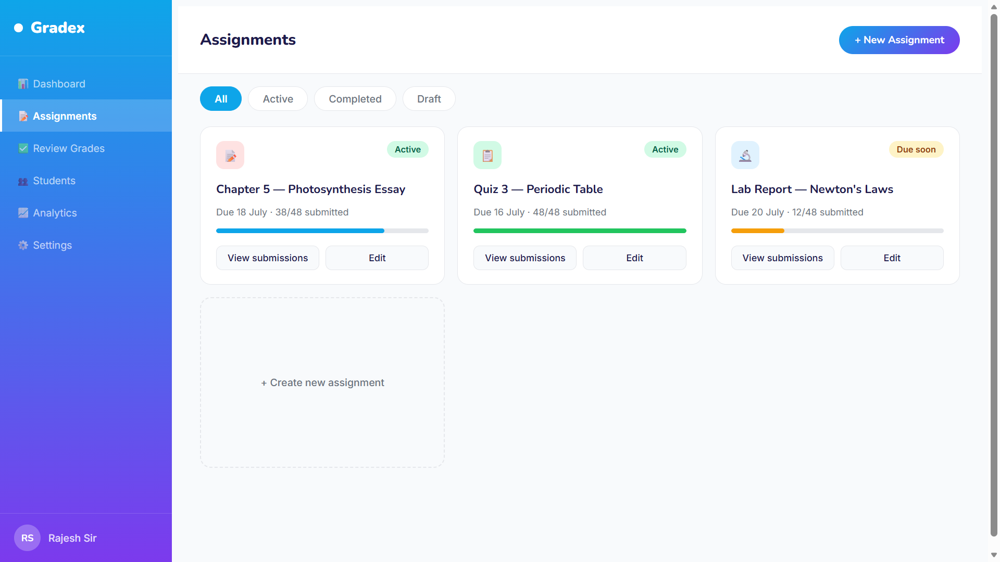
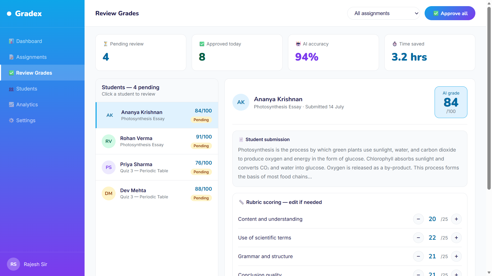
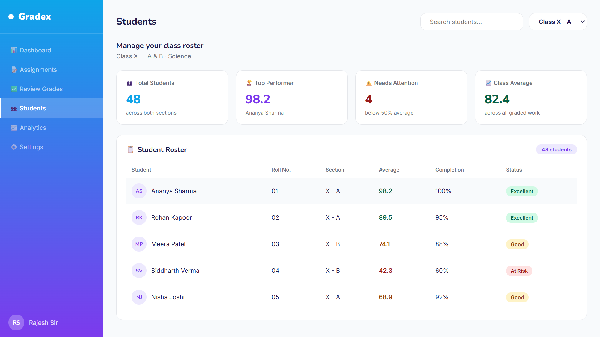

# Gradex — AI Grading Assistant

🌐 **Live Demo** → https://gradex-pink.vercel.app

> A complete frontend project built with HTML, CSS and JavaScript

---

## Screenshots

### Landing Page


### Login Page  


### Teacher Dashboard


### Assignment Page


### Review Grades


### Student Portal


---

## Pages built

| Page | Status |
|------|--------|
| Landing page | ✅ Done |
| Login page | ✅ Done |
| Teacher dashboard | ✅ Done |
| Assignment page | ✅ Done |
| Review grades | ✅ Done |
| Student portal | ✅ Done |
| Analytics | ✅ Done |
| Settings | ✅ Done |

---

## Tech used
- HTML5
- CSS3 — Flexbox, Grid, Animations
- Vanilla JavaScript
- Google Fonts — Nunito + Inter

---

## How to run
1. Clone the repo
```bash
   git clone https://github.com/Goldiiii591/Gradex.git
```
2. Open `index.html` in browser
3. No setup needed!

---

Built with ❤️ while learning frontend development